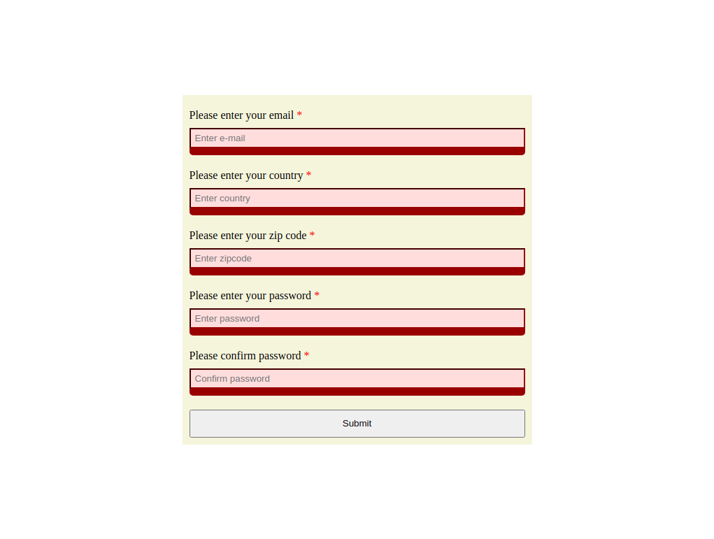

Form Validation Project, made for The Odin Project.

<a href="https://sirjamo1.github.io/Form-validation-Project/">Link to live preview</a>

Features
-   All made through javaScript and css.
-   Validation checks as user progresses through form.
-   Custom error messages displayed depending on input and error.
-   
-   (Css needs work)